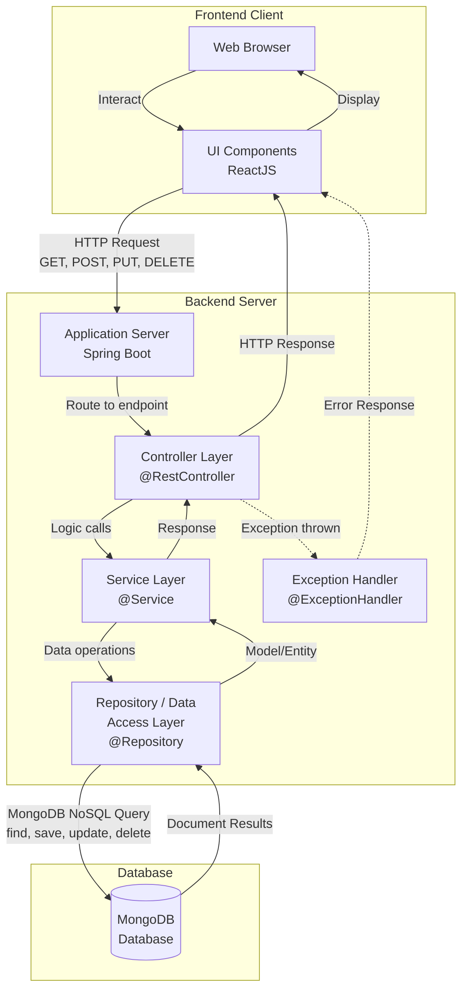

# Block Diagram

```mermaid
flowchart TB
    subgraph Client["Frontend Client"]
        Browser[Web Browser]
        UI[UI Components<br/>ReactJS]
        Browser -->|Interact| UI
        UI -->|Display| Browser
    end
    
    subgraph Server["Backend Server"]
        SpringApp[Application Server<br/>Spring Boot]
        Controller[Controller Layer<br/>@RestController]
        Service[Service Layer<br/>@Service]
        Repository[Repository / Data<br/> Access Layer<br/>@Repository]
        ErrorHandler[Exception Handler<br/>@ExceptionHandler]
    end
    
    subgraph Database["Database"]
        MongoDB[(MongoDB<br/>Database)]
    end
    
    UI -->|HTTP Request<br/>GET, POST, PUT, DELETE| SpringApp
    SpringApp -->|Route to endpoint| Controller
    Controller -->|Logic calls| Service
    Service -->|Data operations| Repository
    Repository -->|MongoDB NoSQL Query<br/>find, save, update, delete| MongoDB
    MongoDB -->|Document Results| Repository
    Repository -->|Model/Entity| Service
    Service -->|Response| Controller
    Controller -->|HTTP Response| UI
    Controller -.->|Exception thrown| ErrorHandler
    ErrorHandler -.->|Error Response| UI
```